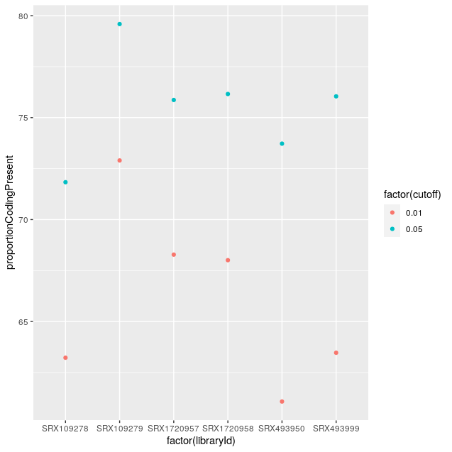

# 0. install BegeeCall

```{r eval=FALSE}

if (!requireNamespace("BiocManager", quietly = TRUE))
  install.packages("BiocManager")
BiocManager::install("BgeeCall")

BiocManager::install("org.Dm.eg.db")
```

```{r, eval=FALSE}
library(org.Dm.eg.db)
library(clusterProfiler)
library(AnnotationDbi)
```

```{r, echo=TRUE}
library(BgeeCall)
library(ggplot2)
library(edgeR)
```

# 1. extract the transcriptome and annotation files 

```{r, eval=FALSE}
# read and store the files of annotation, transcriptome and RNAseq

options(timeout = max(600, getOption("timeout")))

download.file("http://ftp.ensemblgenomes.org/pub/release-51/metazoa/fasta/drosophila_melanogaster/cdna/Drosophila_melanogaster.BDGP6.32.cdna.all.fa.gz",
              "Drosophila_melanogaster.BDGP6.32.cdna.all.fa.gz")

download.file("http://ftp.ensemblgenomes.org/pub/release-51/metazoa/gtf/drosophila_melanogaster/Drosophila_melanogaster.BDGP6.32.51.chr.gtf.gz",
              "Drosophila_melanogaster.BDGP6.32.51.chr.gtf.gz", mode="wininet")

# use R.utils::gunzip() to unzip the .gz file

R.utils::gunzip("Drosophila_melanogaster.BDGP6.32.51.chr.gtf.gz", remove=F)

annotation_object <- rtracklayer::import("Drosophila_melanogaster.BDGP6.32.51.chr.gtf.gz", format = "gtf")             

R.utils::gunzip("Drosophila_melanogaster.BDGP6.32.cdna.all.fa.gz", remove=F)
transcriptome_object <- rtracklayer::import("Drosophila_melanogaster.BDGP6.32.cdna.all.fa.gz", format = "fasta")             

```

# 2. retrieve intergenic information 

## * List all intergenic releases available in BgeeCall. How many exist? 

```{r, echo=TRUE}

list_intergenic_release()

```

There are five intergenic releases : 1.0, 0.2, 0.1, community and custom in BgeeCall.

## * Verify which species are available for the current Bgee intergenic release. How many exist?

```{r, echo=TRUE}
bgee <- new("BgeeMetadata")
list_bgee_ref_intergenic_species(myBgeeMetadata = bgee)

# There are fifty-two species available for the current Bgee intergenic release.
```

## * Verify which species belong to the community. How many exist?

```{r, echo=TRUE}
list_community_ref_intergenic_species()


```

There are two species in the community.


# 3. Use BgeeCall to download the pseudo-alignment software 

#### * Create an object of the KallistoMetadata class 

```{r, eval=FALSE}
kallisto <- new("KallistoMetadata", download_kallisto = TRUE)
```

# 4. Run analysis: Drosophila melanogaster 1 sample ####

## * Create a userMetadata object####
#Specify by using the following functions setRNASeqLibPath(), setTranscriptomeFromFile(), 
#setAnnotationFromFile(), setOutputDir() and setWorkingPath() the path to your library SRX109278, 
#transcriptome file, annotation file as well as the output and working directory. 

```{r, eval=FALSE}
rnaseqlib_path <- "/home/hud/hudie/Bgee/working/RNAlibrary/bgeecall_exercice"
outputdir_path <- "/home/hud/hudie/Bgee/output"
working_path <- "/home/hud/hudie/Bgee/working"

# ID for Drosophila melanogaster is 7227

user_BgeeCall <- new("UserMetadata", species_id = "7227")

user_BgeeCall <- setRNASeqLibPath(user_BgeeCall, 
                                  file.path(rnaseqlib_path, "SRX109278"))
user_BgeeCall <- setAnnotationFromFile(user_BgeeCall, "Drosophila_melanogaster.BDGP6.32.51.chr.gtf.gz", 
                                       "BDGP6")
user_BgeeCall <- setTranscriptomeFromFile(user_BgeeCall, "Drosophila_melanogaster.BDGP6.32.cdna.all.fa.gz", 
                                          "BDGP6")
user_BgeeCall <- setOutputDir(user_BgeeCall, file.path(outputdir_path, "SRX109278"))
user_BgeeCall <- setWorkingPath(user_BgeeCall, working_path)
```

## * What happens if the argument reads_size is not specified by you when you create the new userMetadata object? What can be the impact in general? ####

The reads_size will be set by default as 51 if it is not specified.
If smaller than KallistoMetadata@read_size_kmer_threshold, an index with a kmer size of 15 bp will be used.

## * Generate the present and absent calls for the library SRX109278 by using generate_calls_workflow() ####    

```{r, eval=FALSE}
calls_output <- generate_calls_workflow(abundanceMetadata = kallisto,
                                        userMetadata = user_BgeeCall)
# kmer length = 31
calls_output
```


## * Which type of information is provided in the output files? ####

TPM cutoff for which 95% of the expressed genes are coding found at TPM = 0.230554

```{r, eval=FALSE}
openPDF(calls_output$TPM_distribution_path)

calls_result <- read.table(calls_output$calls_tsv_path, header=TRUE)

tpm_result <- read.table(calls_output$abundance_tsv, header = TRUE)
```

## * Plot the frequency of p-values for the correspondent library. 

```{r, eval=FALSE}
id_intergenic <- read.table(file.path(working_path, "intergenic_1.0", "7227", "intergenic_ids.txt"), sep=" ", header = T)
# length(id_intergenic$intergenic_ids) 
# 2347

tpm_intergenic <- tpm_result[match(id_intergenic$intergenic_ids, tpm_result$target_id), "tpm"]
tpm_intergenic <- tpm_intergenic[tpm_intergenic > 0]

ggplot(calls_result) +
  geom_freqpoly(data = filter(calls_result, counts > 0), aes(x=pValue), bins = 50)
```


# 5. Run analysis: multiple Drosophila melanogaster samples

## * Create a user input file describing all RNA-Seq libraries previously downloaded

```{r, eval=FALSE}
write.table(data.frame(species_id=as.character("7227"),
                       run_ids=c("SRR384929", "SRR384930", "SRR1197301", "SRR1197297", "SRR3419767", "SRR3419768"),
                       reads_size=100,
                       rnaseq_lib_path=paste(rnaseqlib_path, c("SRX109278", "SRX109279", "SRX493950", "SRX493999", "SRX1720957", "SRX1720958"), sep = "/"),
                       transcriptome_path="Drosophila_melanogaster.BDGP6.32.cdna.all.fa.gz",
                       annotation_path="Drosophila_melanogaster.BDGP6.32.51.chr.gtf.gz",
                       working_path=working_path,
                       output_directory=paste(outputdir_path, c("SRX109278", "SRX109279", "SRX493950", "SRX493999", "SRX1720957", "SRX1720958"), sep = "/")),
            file.path(working_path, "userMetadataTemplate.tsv"), sep="\t",row.names=FALSE)
```

## * Run the generation of present and absent calls from the user file with default values for all .-----

```{r, eval=FALSE}
calls_output_all <- generate_calls_workflow(abundanceMetadata = kallisto, 
                                            userFile = file.path(working_path, "userMetadataTemplate.tsv"))
```

## * Combine multiple libraries per species using the merging_libraries() function. What is the proportion of genes present?

```{r, eval=FALSE}
mergingLibraries <- merging_libraries(userFile = file.path(working_path, "userMetadataTemplate.tsv"), approach = "BH", 
                                      condition = "species_id", cutoff = 0.05, outDir = file.path(outputdir_path, "multiple_libs"))
```

## * Modify the input file to combine libraries per species (species_id) and developmental stage (devStage)

```{r, eval=FALSE}
write.table(data.frame(species_id=as.character("7227"),
                       run_ids=c("SRR384929", "SRR384930", "SRR1197301", "SRR1197297", "SRR3419767", "SRR3419768"),
                       reads_size=100,
                       rnaseq_lib_path=paste(rnaseqlib_path, c("SRX109278", "SRX109279", "SRX493950", "SRX493999", "SRX1720957", "SRX1720958"), sep = "/"),
                       transcriptome_path="Drosophila_melanogaster.BDGP6.32.cdna.all.fa.gz",
                       annotation_path="Drosophila_melanogaster.BDGP6.32.51.chr.gtf.gz",
                       #anatEntity=rep("-", 6),
                       devStage=c(rep("FBdv:00007079", 4), rep("UBERON:0000066", 2)),
            output_directory=paste(outputdir_path, c("SRX109278", "SRX109279", "SRX493950", "SRX493999", "SRX1720957", "SRX1720958"), sep = "/")),
file.path(working_path, "userMetadataTemplate_merging.tsv"), sep="\t",row.names=FALSE)

mergingLibraries_modify <- merging_libraries(userFile = file.path(working_path, "userMetadataTemplate_merging.tsv"), approach = "BH", 
                                      condition = c("species_id", "devStage"), cutoff = 0.05, outDir = file.path(outputdir_path, "multiple_libs"))
```

## * Generate the present and absent calls with a more restrictive p-value = 0.01

```{r, eval=FALSE}
mergingLibraries_modify_pvalue <- merging_libraries(userFile = file.path(working_path, "userMetadataTemplate_merging.tsv"), approach = "BH", 
                                             condition = c("species_id", "devStage"), cutoff = 0.01, outDir = file.path(outputdir_path, "multiple_libs"))
```

## * Get summary stats of all libraries by using get_summary_stats() function

```{r, eval=FALSE}
get_summary_stats(userFile = file.path(working_path, "userMetadataTemplate_merging.tsv"), outDir = file.path(outputdir_path, "multiple_libs"))

```

## * Plot the proportion of protein coding genes of all libraries for each p-value cut-off.

```{r, eval=FALSE}
## obtain the summary data of all libraries at p-value cutoff = 0.05

summary_stats <- read.table(file.path(outputdir_path, "multiple_libs", "summary_Stats_All_Libraries.tsv"), sep = "\t", header = TRUE)

## plot the proportions at p-value cutoff = 0.05

data_summ <- summary_stats

ggplot(data_summ)+
  geom_point(aes(x=factor(libraryId), y=proportionCodingPresent))

## Run the generation of present and absent calls again for pvalue cutoff = 0.01

kallisto@cutoff <- 0.01

calls_output_all <- generate_calls_workflow(abundanceMetadata = kallisto, 
                                            userFile = file.path(working_path, "userMetadataTemplate.tsv"))

## Get summary stats of all libraries by using get_summary_stats() function again

get_summary_stats(userFile = file.path(working_path, "userMetadataTemplate_merging.tsv"), outDir = file.path(outputdir_path, "multiple_libs"))

## obtain the summary data of all libraries at p-value cutoff = 0.01

summary_stats <- read.table(file.path(outputdir_path, "multiple_libs", "summary_Stats_All_Libraries.tsv"), sep = "\t", header = TRUE)

data_summ <- rbind(data_summ, summary_stats)

## plot the proportions at p-value cutoff = 0.05 or 0.01

data_summ <- summary_stats

ggplot(data_summ)+
  geom_point(aes(x=factor(libraryId), y=proportionCodingPresent, color=factor(cutoff)))

```



## 6. Downstream analysis

## * Perform a differential expression analysis between different developmental stage conditions.

```{r, eval=FALSE}
library(edgeR)

## select the samples for differential epression analysis

sample_name <- c("SRX109278", "SRX109279", "SRX1720957", "SRX1720958")

## read the count data from each library

data_count <- matrix(ncol=4, nrow = unique(summary_stats$numberCoding))
for(i in 1:4){
  
  ## use the data from coding genes
  
  calls_result <- read.table(file.path(outputdir_path, sample_name[i], "gene_level_abundance+calls.tsv"), header = TRUE, sep = "\t")
  count <- calls_result[calls_result$biotype=="protein_coding", c("id", "counts")]
  
  if(is.null(rownames(data_count))) {
    data_count[, i] <- count[, "counts"]
    
    rownames(data_count) <- calls_result[calls_result$biotype=="protein_coding", c("id")]
    
  } else {
    ## merge the counts according to the genes id.
    data_count[, i] <- count[match(rownames(data_count), count[, "id"]), "counts"]
  }
  
}

colnames(data_count) <- sample_name
head(data_count)

write.csv(data_count, file.path(outputdir_path, "DEA", "counts_FBdv_vs_UBERON.csv"), 
            row.names = TRUE)

## conditions to be considered in the analysis

condition <- factor(c(rep("FBdv:00007079", 2), rep("UBERON:0000066", 2)))

## generate the DGElist 

dge_data <- DGEList(counts=data_count, group = condition)

## filter by the gene expression

dge_keep_index <- filterByExpr(dge_data)
table(dge_keep_index)

dge_keep <- dge_data[dge_keep_index, , keep.lib.sizes=FALSE]

## I filter 10889 genes

dim(dge_keep)

## TMM normalize by the log2CPM

dge_norm <- calcNormFactors(dge_keep)

## construct the model for the analysis

design <- model.matrix(~ condition)

rownames(design) <- colnames(dge_norm)

design

## fit the negative-binomial distribution and calculate the dispersion

fit_NBP <- statmod::fitNBP(dge_norm, group = condition)

## fit the quasi-likelihood

fit_QL <- glmQLFit(dge_norm,design, dispersion = fit_NBP$dispersion)

## plot the QL dispersion scatterplot

plotQLDisp(fit_QL)

## QL F-test for the differential expression analysis

qlf_result <- glmQLFTest(fit_QL)

```


# * Filter the results by providing just genes with FDR < 0.01. Provide a visualization graphic as MA plot. 

```{r, eval=FALSE}
# * Filter the results by providing just genes with FDR < 0.01. Provide a visualization graphic as MA plot. ----

## calculate qvalues

fdr_result <- p.adjust(qlf_result$table$PValue, method = "BH")

## filter genes with FDR < 0. 01

sum(fdr_result < 0.01)
## the genes with FDR < 0.01, totally 7 genes

rownames(qlf_result$table)[which(fdr_result < 0.01)]

## I also use the decideTestDGE() to filter the genes

deGenes <- decideTestsDGE(qlf_result, p=0.01, lfc = 2)

summary(deGenes)
## the result is the same

detag <- rownames(qlf_result)[as.logical(deGenes)]

## plot the MA plot

plotSmear(qlf_result, de.tags=detag)
abline(h=c(-2, 2), col='blue')

```


# * Make a GO analysis. Which type of information do you retrieve? 

```{r, eval=FALSE}
library(cluserProfiler)
library(org.Dm.eg.db)

## firstly I transcribed the geneid like "FBgn0000014" to the SYMBOL type in 
## https://biotools.fr/drosophila/fbgn_converter
## and stored the transcribed SYMBOL as a vector in a .txt file

## read the SYMBOL file

gene_symbol <- read.table(file.path(working_path, "geneid_symbol.txt"),header = F)$V1

## then transcribe the SYMBOL into ENTREZID using clusterProfiler
## org.Dm.eg.db is used to match the SYMBOL and ENTREZID

test <- bitr(gene_symbol, 
            fromType="SYMBOL", 
            toType="ENTREZID",  
            OrgDb="org.Dm.eg.db") 

## do the GO analysis
go_data <-enrichGO( gene = test$ENTREZID,
                    OrgDb = org.Dm.eg.db,
                    keyType = "ENTREZID",
                    ont = "ALL",
                    pvalueCutoff = 1,
                    qvalueCutoff = 1,
                    readable = T)


barplot(go_data, showCategory=20,title="EnrichmentGO")
dotplot(go_data,title="EnrichmentGO_dot")


```